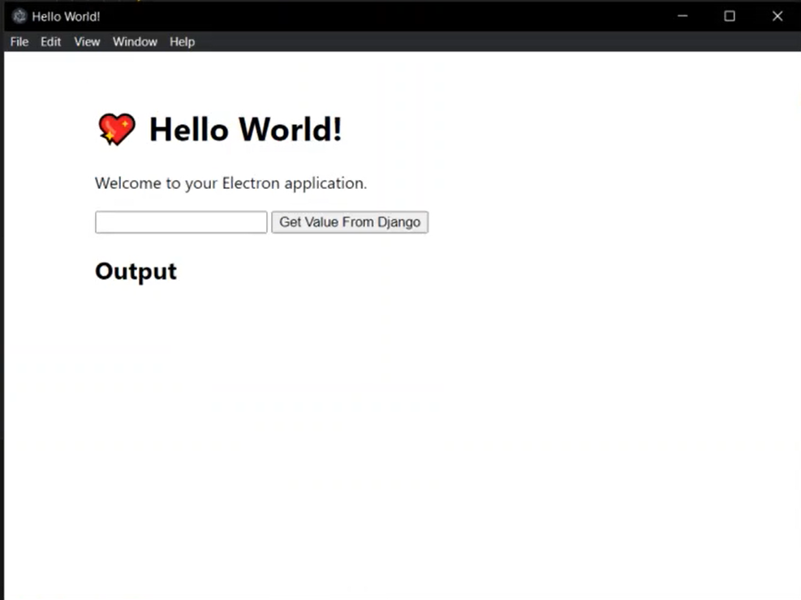

In this week the task was to run an electron instance using django server as backend 
## Work Done
* Ran an electron instance using django server as backend
* Configured the electron-forge to be compatible with django server

## Plan for next week

* Create the frontend for the cross-platform desktop application