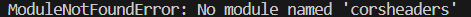

In our recent endeavors, we dedicated our efforts to address the essential packages and dependencies essential for seamless operation of the Django server. However, during this process, we encountered some challenges pertaining to the utilization of dependencies such as pylint and corsheaders. These dependencies demanded a more up-to-date version of Django, specifically one that exceeds 3.2.

