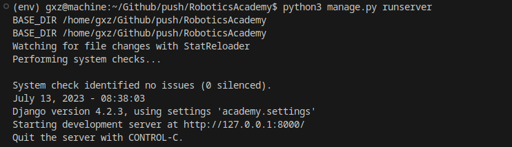
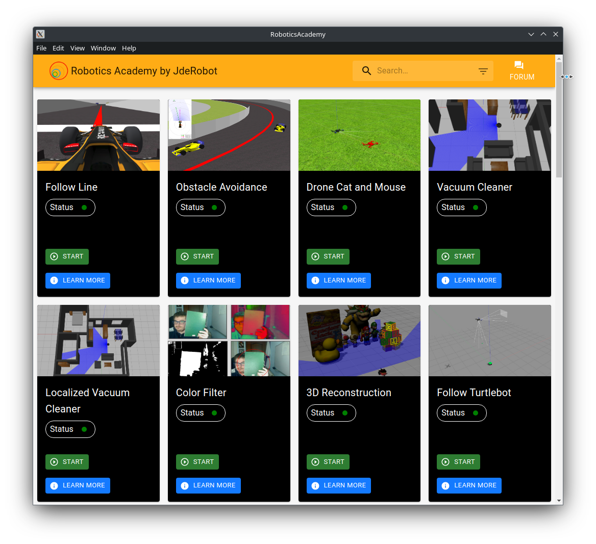

In this week the first plan of action was to setup the electron and serve the React Frontend inside the electron process but 
it came with multiple conflicts and challenges.At first we decided to use vite to bundle the Djano-react application but the backend that serves the template for the react-frontend couldn't be imported into vite and the electron process within vite was expensive as well

After this We decided to make a new frontend for the electron application but that approach didn't follow up because it would be redundant process and decided to use the existing frontend using electron-forge.

```console
 yarn create electron-app electron
```

Was able to run and serve the react frontend locally inside the electron instance but at this point the backend for the Robotics Academy was running outside the electron instance and had to be started before firing up the electron process.

 

 For Now We were simply sending a request to the backend to serve the electron process as follows 



## Work Done 
* Build Electron structure for the application 
* Starting and serving the electron instance locally

## Learning 
* The working of Django template and its working with react
* Serving static content inside React

## Issues Created
[https://github.com/JdeRobot/RoboticsAcademy/issues/2170](https://github.com/JdeRobot/RoboticsAcademy/issues/2170)

## PR's Created
[https://github.com/JdeRobot/RoboticsAcademy/pull/2171](https://github.com/JdeRobot/RoboticsAcademy/pull/2171)


## Plan for Next Week
* Serve the Robotics Academy Backend concurrently along with the Electron Instance