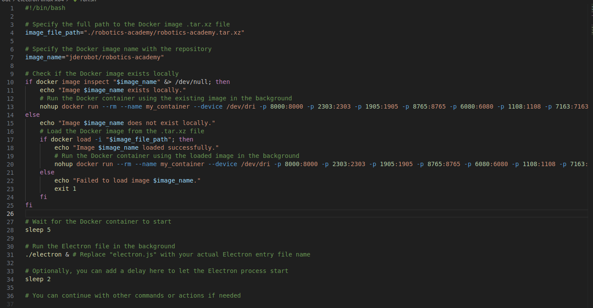

Automating the Deployment of an Electron App with Docker

In this week, I successfully built the Electron app in the out folder. However, to run the app, we previously needed to run the backend via the Docker image. This was a manual process that required the user to have Docker installed and to know how to use it.

To make the process more user-friendly, I created a script that automates the deployment of the app. The script first checks if Docker is installed. If it is, the script then searches for the Dockerfile. If the Dockerfile doesn't exist, the script pulls the Docker image from the registry. Otherwise, the script runs the Docker image.

This script significantly reduces the number of steps that the user has to follow to run the app. Now, the user can simply run the script and the app will be deployed automatically.

Here are some of the technical details of the script:

- The script is written in **Bash**.
- The script uses the subprocess module to execute the Docker commands.
- The script checks if Docker is installed by running the docker command.
- The script searches for the Dockerfile by looking for the file Dockerfile in the current directory.
- The script pulls the Docker image from the registry by running the command docker pull **jderobot/robotics-academy**.
- The script runs the Docker image by running the command :

```
  docker run --rm -it -p 8000:8000 -p 2303:2303 -p 1905:1905 -p 8765:8765 -p 6080:6080.
```

## Work Done



<iframe width="560" height="315" src="https://www.youtube.com/embed/AJICO2IiylM?si=ChFYKrs8y_MOeeBR" title="YouTube video player" frameborder="0" allow="accelerometer; autoplay; clipboard-write; encrypted-media; gyroscope; picture-in-picture; web-share" allowfullscreen></iframe>

## PR'S Created

[https://github.com/JdeRobot/RoboticsAcademy-Desktop/commit/2e66b182c2ec90fa7deab2c7d885265c6221db82](https://github.com/JdeRobot/RoboticsAcademy-Desktop/commit/2e66b182c2ec90fa7deab2c7d885265c6221db82)

## Learnings

- The importance of automation. The script that I created automates the deployment of the Electron app. This makes the process much more user-friendly and reduces the number of steps that the user has to follow.

- The power of Docker. Docker is a powerful tool that can be used to automate the deployment of applications. The script that I created uses Docker to pull and run the Docker image for the Electron app.

- The importance of testing. I tested the script extensively to make sure that it was working properly. This helped me to identify and fix any errors in the script.

## Plan for Next week

- Make Changes to the UI.
