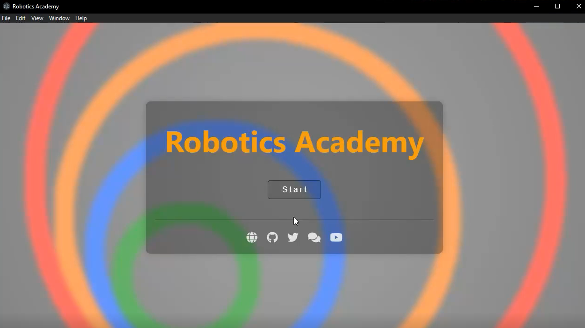

Revamped the User Interface (UI) of the Robotics Academy application by implementing a comprehensive redesign focused on enhancing its visual appeal and user-friendliness. This involved introducing a landing page before loading the exercises providing a more user appealing approach.

To achieve a more engaging and intuitive user experience, we added interactivity with the Links and buttons leading to specific information.

## Work Done

## PR's

## Learnings

-Comprehensive Redesign: The first key takeaway is the importance of a comprehensive redesign when aiming to improve user interface (UI) and user experience (UX). This involves a thorough examination and modification of visual elements, navigation systems, and interaction patterns to create a more cohesive and engaging interface.

-User-Centric Approach: The second learning is the significance of a user-centric approach in UI/UX design. By conducting user research and aligning design choices with user needs and preferences, the new UI was optimized to enhance usability and meet the expectations of the target audience.

-Accessibility Integration: The third takeaway emphasizes the importance of accessibility in modern UI/UX design. Ensuring that the application is compliant with accessibility standards, such as WCAG, and providing features like keyboard navigation and screen reader compatibility, demonstrates a commitment to inclusivity and a wider user base.

## Plan for Next week

- Develop a Script for the Window Users
